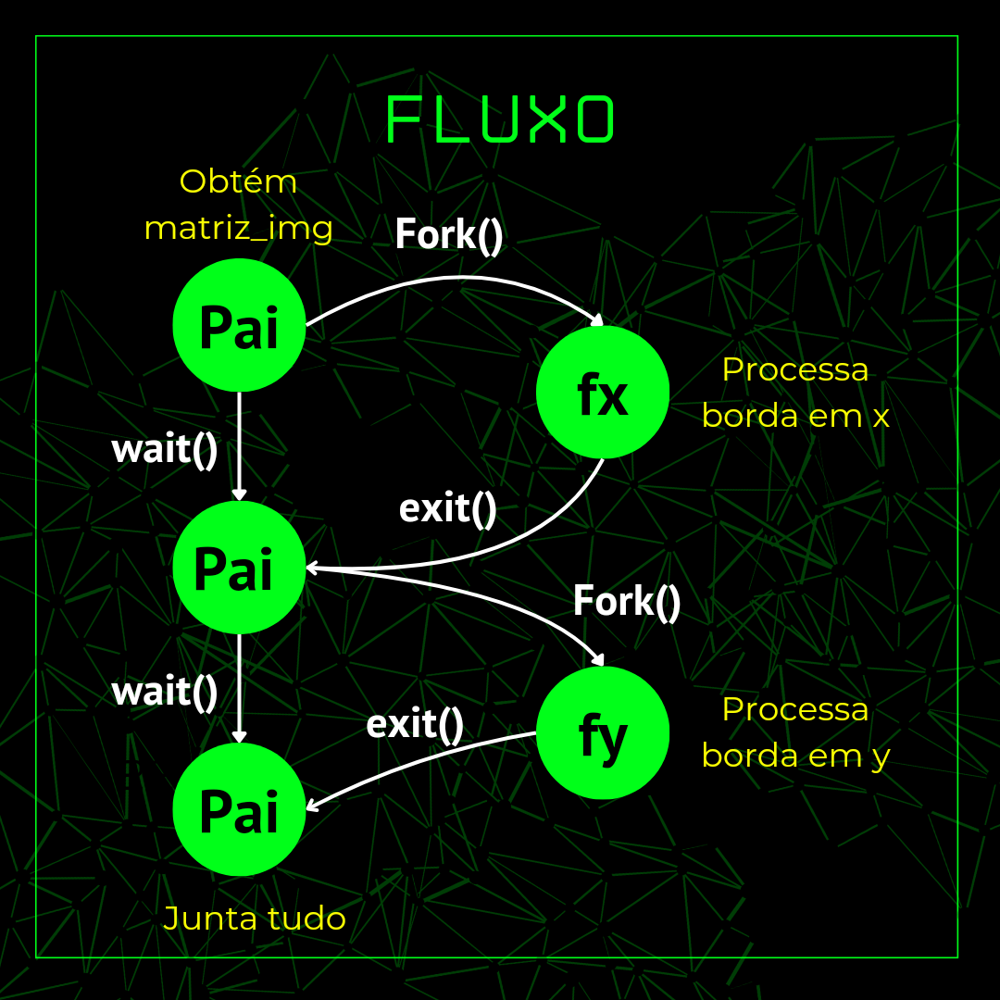
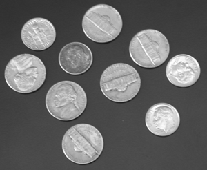
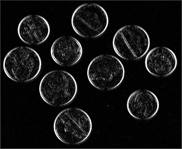
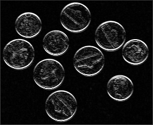
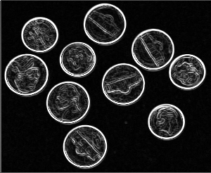

# Solução usando processos

> Algoritmo para detecção de borda em imagens usando o conceito de processos

Bom já que entendemos como devemos calcular a borda de uma imagem, vamos ultilizar os conceitos de processos para nos ajudar nessa tarefa.

## 🔄 Fluxo do programa

vamos dividir nosso programa da seguinte maneira:

<p align='center'>
    
</p>

### [1/4] 🔵 Criando um processo pai

Vamos criar um processo pai que possa fazer a abertura de uma imagem em nível de cinza e que crie as estruturas de dados necessárias para representar essa imagem.

**👨‍💻 REPRESENTAÇÃO NO CÓDIGO EM C**:
```c
int main(void){
  ...
  
  //primeira parte - alocando uma matriz com os valores da imagem
  FILE *arquivo = fopen("coins.ascii.pgm","r");
  int colunas, linhas;

  char buffer[256];

  if(arquivo == NULL){
    printf("erro na abertura de arquivo");
  }else{
    //desconsiderando algumas linhas
    fgets(buffer, sizeof(buffer), arquivo);
    fgets(buffer, sizeof(buffer), arquivo);
    fscanf(arquivo, "%d %d", &colunas, &linhas); //obtendo o tamanho da imagem 
    fgets(buffer, sizeof(buffer), arquivo);
    fgets(buffer, sizeof(buffer), arquivo);
  }

  int **matriz_img = create_matriz(linhas, colunas);

  //add valores da imagem na matriz_img
  for(int i = 0; i<linhas; i++){
    for(int j=0;j<colunas;j++){
      int valor;
        fscanf(arquivo, "%d", &valor);
        matriz_img[i][j] = valor;
    }
  }
  
  fclose(arquivo);
  ...
```

**🔑 EXPLICANDO PARTES CHAVES**
- Usamos o metodo **fopen(nome_do_arquivo, "r")** para abrir o arquivo em `ascii.pgm` da imagem, como modo de leitura ativado;

- O metodo **fscanf()** é usado para obter o valor do arquivo e atribuir a alguma variável, como no caso `fscanf(arquivo, "%d %d", &colunas, &linhas);` que pegamos a altura e a largura da imagem;

- Alocamos uma matriz **(matriz_img)** usando a função **create_matriz()**;

- usando novamente o método **fscanf()**, atribuimos os valores correspondentes do arquivo da imagem na matriz `matriz_img`.

### [2/4] 🔵 Detectando bordas no eixo X

O processo pai deve executar a função **fork()** para criar um processo filho. Este novo
processo deve usar a matriz **matriz_img** para gerar as informações das bordas, na direção x, da
imagem de entrada. Estas informações da borda devem ficar em uma matriz **matriz_x** e,posteriormente, disponibilizadas para o processo pai, através do arquivo **coins_x.ascii.pgm** . Após executar **fork()**, o processo pai deve
aguardar a execução do processo filho através da função **wait()**. Ele retorna à execução
quando o filho for finalizado.

**👨‍💻 REPRESENTAÇÃO NO CÓDIGO EM C**:
```c
  int pid1, filho1, estado1;

  //criando o primeiro processo filho que gerará o arquivo com a imagem processada no eixo x
  pid1 = fork();
    
  if(pid1 < 0){
    printf("Erro na criação do processo filho!");
    exit(-1);
  }
    
  if(pid1 == 0){
    int **matriz_x = create_matriz(linhas, colunas);
    FILE *arquivo_x = fopen("coins_x.ascii.pgm", "w");
    
    //incluir as linhas bases
    fprintf(arquivo_x,"P2\n");
    fprintf(arquivo_x,"# fred.pgm created by PGMA_IO::PGMA_WRITE.\n");
    fprintf(arquivo_x,"%d %d\n", 300, 246);
    fprintf(arquivo_x, "%d\n", 255);

    if(arquivo_x == NULL){
      printf("erro na abertura de arquivo");
    }else{  
      for(int i = 0; i < linhas; i++){
        for(int j = 0; j < colunas; j++){
          if(i == 0 || j == 0 || i == linhas-1 || j == colunas-1){
            fprintf(arquivo_x, "%d  ", matriz_img[i][j]);
          }else{
            int parcela1 = matriz_img[i-1][j-1] + matriz_img[i][j-1] + matriz_img[i+1][j-1];
            int parcela2 = matriz_img[i-1][j+1] + matriz_img[i][j+1] + matriz_img[i+1][j+1];
            matriz_x[i][j] = parcela2 - parcela1;
            
            if(matriz_x[i][j] > 255){
              matriz_x[i][j] = 255;
            }
            
            if(matriz_x[i][j] < 0){
              matriz_x[i][j] = -1*matriz_x[i][j];
              if(matriz_x[i][j] > 255){
                matriz_x[i][j] = 255;
              }
            }

            fprintf(arquivo_x, "%d  ", matriz_x[i][j]);
          }
        }
        fprintf(arquivo_x, "\n");
      }
    }
    fclose(arquivo_x);
    free(matriz_x[0]);
    free(matriz_x);
  }else{
    filho1 = wait(&estado1);
    exit(0);
  }
```

**🔑 EXPLICANDO PARTES CHAVES**
- Quando executamos o comando `pid1 = fork()` estamos criando um processo filho. verificamos se essa operação foi bem sucedida ao comparar o valor da variável **pid1**, que se caso for **igual a zero** temos um processo filho criado com sucesso, porém se o **pid1** for **igual a -1** ocorreu um erro na criação.

- Todo o código presente dentro do `if(pid1 ==0)` está relacionado ao processo filho, ou seja, ele possui acesso a **matriz_img** do processo pai, porém as variaveis que serão decladas no processo filho não serão acessiveis pelo pai diretamente.

- Então usamos o **fopen()** para criar um novo arquivo **coins_x.ascii.pgm** que terá os dados referentes ao processamento da imagem em torno do **eixo x**.

- Executamos os calculos da convolução para cada pixel, e fazemos as verificações para que os valores permanecam entre **0 e 255**.

- O comando `filho1 = wait(&estado1);` faz com que o processo pai espere que o processo filho termine sua execução. 

- O comando `exit()` é chamado para encerrar o processo.

### [3/4] 🔵 Detectando bordas no eixo Y

O processo pai deve executar uma nova chamada da função **fork()**, gerando um novo
processo filho. Este novo processo deve usar a matriz **matriz_img** para gerar as informações da
borda da imagem na direção y, salvando os resultados em uma matriz **matriz_y** e
disponibilizando-a para o processo pai através do arquivo **coins_y.ascii.pgm**. Do mesmo modo, o pai deve executar a chamada wait(), fazendo com que ele fique
em estado de espera até que este novo filho finalize sua tarefa.

**👨‍💻 REPRESENTAÇÃO NO CÓDIGO EM C**:
```c
  //criando o processo do filho 2 para realizar o processamento na imagem no eixo y
  pid2 = fork();
  
  if(pid2 < 0){
    printf("Erro na criação do processo filho!");
    exit(-1);
  }
  
  if(pid2 == 0){
    int **matriz_y = create_matriz(linhas, colunas);
    //obtendo a imagem com o processamento de deteccao de borda do eixo y
    FILE *arquivo_y = fopen("coins_y.ascii.pgm", "w");
    //incluir as linhas bases
    fprintf(arquivo_y,"P2\n");
    fprintf(arquivo_y,"# fred.pgm created by PGMA_IO::PGMA_WRITE.\n");
    fprintf(arquivo_y,"%d %d\n", 300, 246);
    fprintf(arquivo_y, "%d\n", 255);

    if(arquivo_y == NULL){
      printf("erro na abertura de arquivo");
    }else{
      for(int i = 0; i < linhas; i++){
        for(int j = 0; j < colunas; j++){
          if(i == 0 || j == 0 || i == linhas-1 || j == colunas-1){
            fprintf(arquivo_y, "%d  ", matriz_img[i][j]);
          }else{
            int parcela1 = matriz_img[i-1][j-1] + matriz_img[i-1][j] + matriz_img[i-1][j+1];
            int parcela2 = matriz_img[i+1][j-1] + matriz_img[i+1][j] + matriz_img[i+1][j+1];
            matriz_y[i][j] = parcela2 - parcela1;
            
            if(matriz_y[i][j] > 255){
              matriz_y[i][j] = 255;
            }
            
            if(matriz_y[i][j] < 0){
              matriz_y[i][j] = -1*matriz_y[i][j];
              if(matriz_y[i][j] > 255){
                matriz_y[i][j] = 255;
              }
            }

            fprintf(arquivo_y, "%d  ", matriz_y[i][j]);
          }
        }
        fprintf(arquivo_y, "\n");
      }
    }
    fclose(arquivo_y);
    free(matriz_y[0]);
    free(matriz_y);
  }else{
    filho2 = wait(&estado2);
    exit(0);
  }
```

**🔑 EXPLICANDO PARTES CHAVES**

- As mesmas partes chaves para essa parte do código são semelhantes com a anterior, porém alterando o processamento para a detecção da borda no **eixo y**.

### [4/4] 🔵 Mesclando as bordas X e Y

Por fim, após a execução dos filhos, o processo pai utiliza as informações dos arquivos **coins_x.ascii.pgm** e **coins_y.ascii.pgm** para gerar um novo arquivo com as informações das bordas final **arquivo_final.ascii.pgm**. Esse resultado
deve ser salvo como uma imagem.

**👨‍💻 REPRESENTAÇÃO NO CÓDIGO EM C**:
```c
  //unindo os arquivos
  FILE *arquivo_final = fopen("arquivo_final.ascii.pgm", "w");
  FILE *arquivo_X = fopen("coins_x.ascii.pgm", "r");
  FILE *arquivo_Y = fopen("coins_y.ascii.pgm", "r");
  
  if(arquivo_final == NULL){
    printf("Erro em abrir o arquivo_final!");
  }else{
    //incluir as linhas bases
    fprintf(arquivo_final,"P2\n");
    fprintf(arquivo_final,"# fred.pgm created by PGMA_IO::PGMA_WRITE.\n");
    fprintf(arquivo_final,"%d %d\n", 300, 246);
    fprintf(arquivo_final, "%d\n", 255);
    
    if(arquivo_X == NULL && arquivo_Y == NULL){
      printf("Erro em abrir o arquivo_x ou arquivo_y!");
    }else{
      //desconsiderando algumas linhas arquivo x
      for(int i=0; i<3; i++){
        fgets(buffer, sizeof(buffer), arquivo_X);
        fgets(buffer, sizeof(buffer), arquivo_Y);
      }

      for(int i=0; i<linhas; i++){
        for(int j=0; j<colunas; j++){
          int valueX, valueY, sumValues;
          fscanf(arquivo_X,"%d", &valueX);
          fscanf(arquivo_Y,"%d", &valueY);
          sumValues = sqrt((valueX * valueX) + (valueY * valueY));
          //sumValues = valueX + valueY;
          

          if(sumValues > 255){
            sumValues = 255;
          }
          
          fprintf(arquivo_final, "%d ", sumValues);
        }
      }
    }
  }
  
  free(matriz_img[0]);
  free(matriz_img);
```

## 🔍 Analisando os resultados

Vamos Observar quais foram os resultados derivados dos processamento da imagem nas tres situações? 

### [1/4] 🔶 Imagem antes do processamento

<p align='center'>
    
</p>

### [1/3] 🔶 Borda em x

<p align='center'>
    
</p>

### [2/3] 🔶 Borda em y

<p align='center'>
    
</p>

### [3/3] 🔶 Borda Mesclada

<p align='center'>
    
</p>