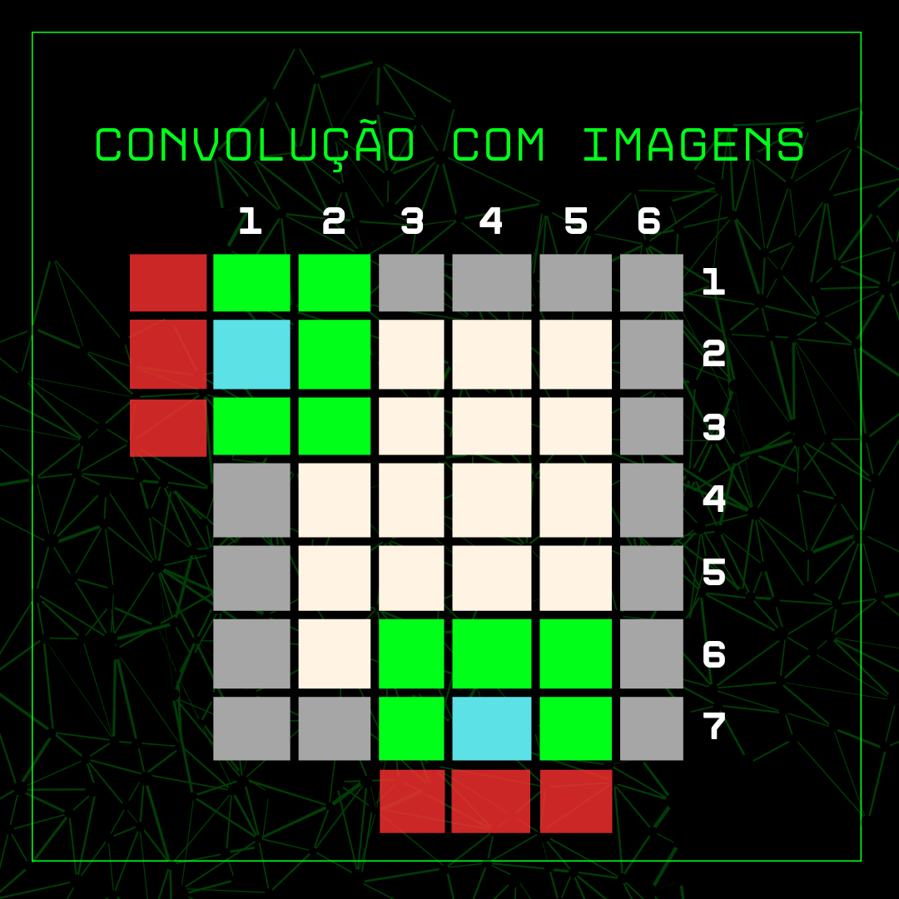
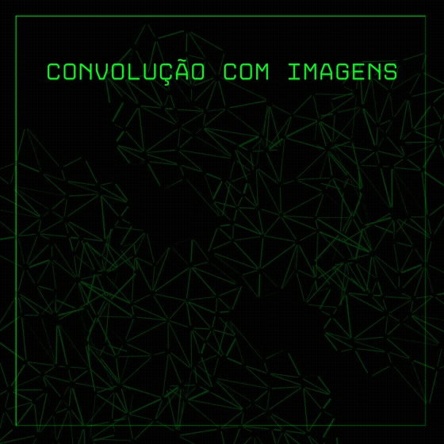

# Detecção de bordas em imagens

> desenvolvimento de um algoritmo para detecção de borda em imagens (processamento de imagem)

**obs**: O Arquivo original desenvolvido pelo professor **Diogo Pinheiro Fernandes Pedrosa (diogo.pedrosa@ufrn.br)** está neste [link](https://drive.google.com/file/d/1dVhv4gRqLFQR_x1HROlrY6U14ozjzdnD/view?usp=sharing). Este repositorio será uma maneira de adapar o que esta no arquivo para o github, então pode ser que tenha seções copiadas do arquivo original.

## 🧩 Contextualização

A área de processamento e análise de imagens digitais teve um grande avanço nos primeiros anos do século XXI, impulsionado pela pesquisa e desenvolvimento de tecnologias para áreas como medicina, biologia, automação industrial e sensoriamento remoto. O processamento digital de imagens envolve técnicas para capturar, representar e transformar imagens com computadores, permitindo extrair informações e melhorar a qualidade visual. Uma etapa importante desse processo é a segmentação, que identifica áreas de interesse na imagem, como bordas ou regiões. A detecção de bordas, por exemplo, busca identificar limites entre regiões com diferentes intensidades de pixels. Isso é feito através de operações de convolução com máscaras, como os operadores de Prewitt, que são amplamente utilizados para essa finalidade.

## 🔍 Detecção de bordas

A tarefa de **detecção de bordas** consiste em determinar o limite, ou fronteira, entre duas regiões
com propriedades e características distintas das intensidades dos pixels da imagem.
Considerando que a imagem consiste em um array **M por N**, no qual podem-se definir as
direções x e y, a detecção de bordas poderá ser obtida através de uma operação de
**convolução** entre uma máscara (que configura-se como um operador) que é aplicado sobre um
pixel de interesse da imagem e também em seus pixels vizinhos. Há diversos operadores para
realizar essa tarefa. Um exemplo são os **operadores de Prewitt**, dados pelas matrizes a seguir:

$$
\text{Gx} = 
\begin{bmatrix}
-1 & 0 & 1 \\
-1 & 0 & 1 \\
-1 & 0 & 1 \\
\end{bmatrix}
$$

$$
\text{Gy} = 
\begin{bmatrix}
-1 & -1 & -1 \\
0 & 0 & 0 \\
1 & 1 & 1 \\
\end{bmatrix}
$$

onde **Gx** e **Gy** são as máscaras para detecção de bordas nas direções x e y da imagem digital. A imagem final segmentada é dada pela junção das imagens das duas bordas obtidas.

### 🔶 Vamos fazer um pequeno exemplo de detecção de bordas

Como foi dito anteriormente, precisamos fazer a operação de **convolução** da mascára (operadores de Prewitt) com cada pixel da imagem. A convolução digital entre sinais é dada pela expressão:

$$
y[n] = x[n] * h[n] = \sum_{k=-\infty}^{\infty} x[k] \cdot h[n-k]
$$

🤔 Antes de interpretamos a forma da convolução para a nossa aplicação, devemos levantar algumas considerações antes:

- Nossa imagem precisa esta em **escala de cinza**, ou seja, os valores para cada pixel deverá ser representado por um valor discreto que deve está no intervalo de **0**(preto) a **255**(branco).

- Os pixels que se encontram na borda da imagem não são calculados, pois para realizar o calculo da convolução nos pixels das bordas, precisamos acessar os pixels que estão nas laterais do pixel principal a ser calculado, ou seja, em algumas situações não temos acesso aos pixels nescessarios para realizar o calculo. podemos ver isso na imagem a seguir: 

    

com essas considerações feitas, a convolução da imagem por uma mascara é representada pelo 
 abaixo:

    

Como estamos fazendo a convolução entre matrizes, devemos multiplicar os elementos com indicies equivalentes da mascara com a matriz conrrespondente a imagem e no final fazer a somatória total.

**lembrando que isso foi apenas para um pixel e na direção de Y, devemos fazer esse procedimento para todos os pixels da imagem e também para o eixo X**.

Então já que agora sabemos como fazer para um pixel especifico, vamos generalizar tanto para o eixo x como para o y? simboraa...

#### Eixo 🇾

Se pegarmos o exemplo que foi feito no gif temos:

$$
pixel[4][4] = (-pixel[3][3] - pixel[3][4] - pixel[3][5]) + (pixel[5][3] + pixel[5][4] + pixel[5][5])
$$

Perceba que no primeiro termo da soma, temos que a linha continua em `3`, que é **4-1=3**. e que a coluna começa de **4-1=3** e vai até **4+1=5**. Uma coisa semelhante acontece na outra parcela da soma, mas ao inves da linha ser 3 é 5 que é **4+1=5**.

agora vamos substituir por valores genericos **i** e **j**:

$$
pixel[i][j] = (-pixel[i-1][j-1] - pixel[i-1][j] - pixel[i-1][j+1]) + (pixel[i+1][j-1] + pixel[i+1][j] + pixel[i+1][j+1])
$$

#### Eixo 🇽

Fazendo os mesmos procedimentos e usando como mascara a matriz **Gx**, temos a seguinte expressão generica para um pixel de uma imagem em escala de cinza:

$$
pixel[i][j] = (-pixel[i-1][j-1] - pixel[i][j-1] - pixel[i+1][j-1]) + (pixel[i-1][j+1] + pixel[i][j+1] + pixel[i+1][j+1])
$$

**⚠️ observações**:

- quando um valor do pixel for maior que 255 ele será colocado com o valor de 255;
- se o valor do pixel calculado for menor que zero, seu valor será o módulo desse valor;
- como não podemos calcular os pixels das bordas, dado uma matriz (M x N) devemos percorrer as linhas de 1 até M-2 e as colunas de 1 até N-2.

## 💡 Solução

Nesta seção, você encontrará as soluções para os problemas propostos relacionados à detecção de bordas de imagem utilizando processos e threads:

- [📌 Solução usando Processos](https://github.com/CarlosG18/so_dca0108/blob/main/unidade1/u1t1/processo/u1t1_process.md)

- [📌 Solução usando Threads](https://github.com/CarlosG18/so_dca0108/blob/main/unidade1/u1t1/thread/u1t1_threads.md)